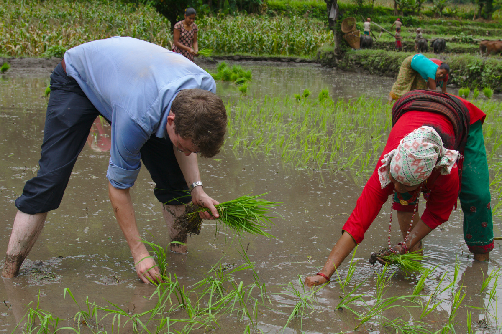

## CV

[CV in pdf format](/cv.pdf) 

## Research area

I study social norms, their origin, and how they change over time. I do this by attending to a combination of social dynamics and evolved aspects of human psychology. More recently, I have also begun thinking of norms themselves as subject to selective pressures and displaying other evolutionary properties. 

## Methodological expertise

I use a variety of research designs in my work and am competent in both qualitative and quantitative methods.

After completing my PhD, I joined the [Department of Methodology at LSE](https://www.lse.ac.uk/methodology), first as a fully-funded ESRC postdoctoral fellow, and now as a Teaching Fellow. 

Research methods are at the centre of both my teaching and research activities. I am passionate about developing high-quality research designs that combine the deep ecological validity of ethnography and the rigour, systematicity and careful approach to causal inference of quantitative approaches.

## Regional focus

The bulk of my research has been conducted in Nepal. I conducted 21 months of ethnographic fieldwork in this country for my doctoral studies and have continued to work there since.

More recently, I have also done some work in India as part of the [Social Gaze](projects/social-gaze) project.

_Ivan Deschenaux planting rice with local residents during fieldwork in Nepal._

## Education

| Year | Degree                                                                       |
|:-----|:-----------------------------------------------------------------------------|
| 2019 | PhD Social Anthropology, London School of Economics                          |
| 2013 | MRes Social Anthropology, London School of Economics                         |
| 2012 | MSc Social Anthropology (Learning and Cognition), London School of Economics |
| 2010 | BA Philosophy, University of Fribourg, Switzerland                           |

## Publications

[List of publications](/publications/)
